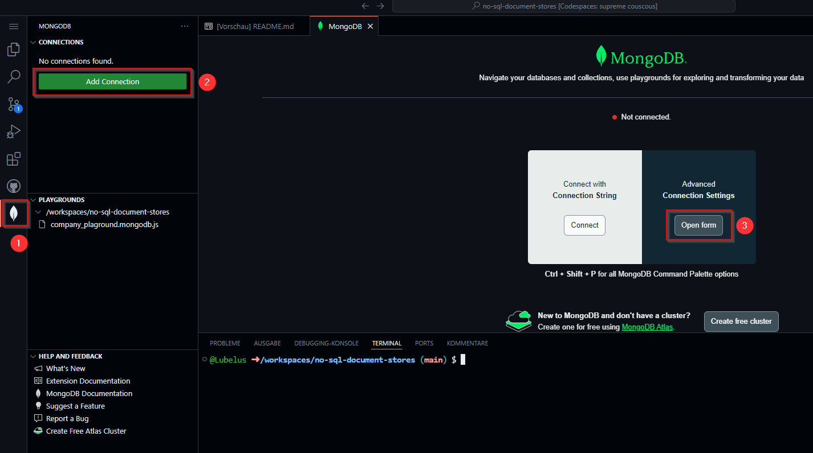
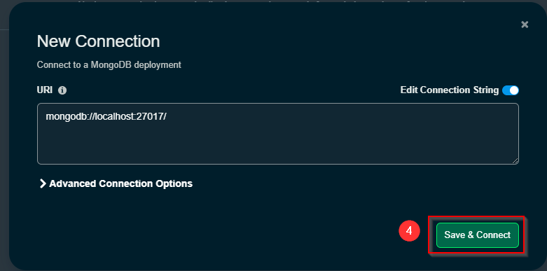
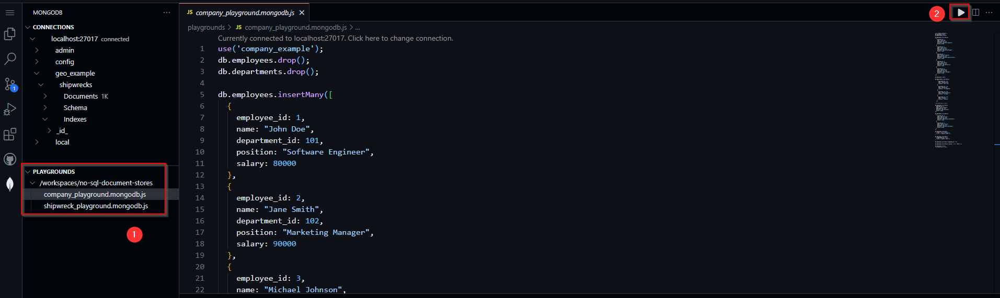

# Codespace für Document Stores (MongoDB & NodeJS)

Das Repository kann als **Github Codespace** geöffnet werden. Dadurch startet eine eine Instanz von Visual Studio Code im Browser. Es funktioniert aber genauso, wenn das Repository lokal gecloned wird. Voraussetzung dafür ist nur die Installation von **Node.js**.

## Initialisieren des Codespaces

Zu Beginn sollte der folgende Befehl ausgeführt werden:

```Shell
npm install
```

## Verbindung zur lokalen Datenbank herstellen

1. MongoDB Erweiterung öffnen
2. "Add Connection" klicken
3. "Open form" unter "Advanced Connection Settings" klicken
4. Mit der Default-URI `mongodb://localhost:27017/` auf "Save & Connect" klicken
5. Verbindung ansehen





# Playgrounds starten

Über die MongoDB Erweiterung können sogenannte **Playgrounds** genutzt werden. Dabei handelt es sich um interaktive Umgebungen, in denen MongoDB-Befehle und -Abfragen ausgeführt werden können. Die Ergebnisse werden in Echtzeit angezeigt.

Sie sind unter den Verbindungen zu finden. Der Code darin kann komplett oder zum Teil (durch Markieren) ausgeführt werden:



## Company Example (Grundlegende CRUD Operationen)
In der Datei [company_playground.mongodb.js](playgrounds/company_playground.mongodb.js) befinden sich Skripte für grundlegende CRUD-Operationen und erste Abfragen. Es handelt sich um die Beispiele, die auch [hier](markdown/grundlagen.md) erklärt sind.


## Shipwreck Example (Shipwrecks Collection inkl. Geo-Daten)
In der Datei [shipwreck_playground.mongodb.js](playgrounds/shipwreck_playground.mongodb.js) steht zu Beginn eine Variable im JSON-Format. Diese enthält 1000 Dokumente aus dem [Beispiel-Datensatz von MongoDB für Geo-Daten](https://www.mongodb.com/docs/atlas/sample-data/sample-geospatial/).

Durch das Ausführen des Skripts, werden diese Dokumente in eine Collection namens "shipwrecks" geschrieben. Auf dieser Collection basieren die Übungsaufgaben, die am unteren Ende der Datei zu finden sind.

Generell hilft beim Durchführen der Übungsaufgaben die MongoDB Dokumentation zu [Geosaptial Query Operators](https://www.mongodb.com/docs/manual/reference/operator/query-geospatial/).